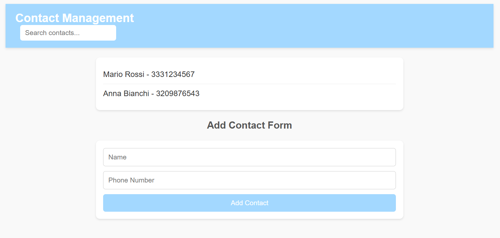

# Contact Management App

This is a simple **Contact Management App** built using **Vue 3**. It allows users to manage their contacts by:
- Viewing a list of predefined contacts.
- Adding new contacts.
- Searching contacts in real time.

The app uses basic features of Vue 3 with Composition API and component-based architecture.

---

## **Final Output**

---

## **Features**
1. **View Contacts**: Displays a list of contacts.
2. **Add Contacts**: Allows users to add new contacts with a name and phone number.
3. **Search Contacts**: Dynamically filters contacts in real time as you type in the search bar.
4. **LocalStorage Integration**: Contacts are stored in the browser's `localStorage` for persistence.

---

## **Technologies Used**
- **Vue 3**: For building the frontend.
- **HTML/CSS**: For structuring and styling.
- **JavaScript**: For interactive behavior.
- **LocalStorage**: For saving and retrieving contact data.

---
